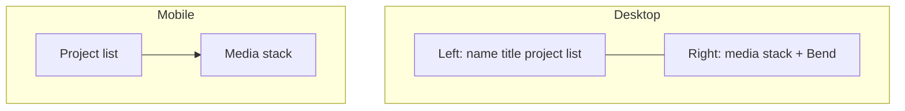
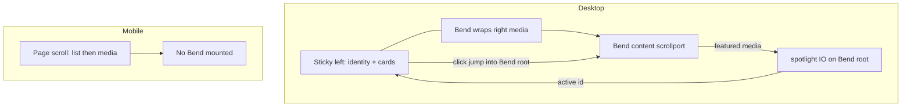

# Portfolio Home Page - Plan

## Goal Capsule

- **Objective:** Ship a single polished React portfolio home page that matches the Paper two-column composition, with scroll-linked project spotlight, left-card reveal, and right-column bend (with fallback) — for hire and peer recognition.
- **Product authority:** This plan owns the home-page experience only. Cloudflare hosting and GoDaddy domain wiring are surrounding work, not active scope.
- **Open blockers:** None.
- **Product Contract preservation:** restructured, no scope change: KD6/R11 tightened to omit Bend on mobile (matches confirmed planning choice); R13 added for reduced-motion already assumed in Dependencies; AE3/F3/F4 cover links corrected.

---

## Product Contract

### Summary

Build a greenfield React portfolio home page for Adam Zelinski (Head of Design).
Desktop follows the Paper split layout: left project list, right media stack with placeholders.
Scroll links the active project to featured media; left cards reveal into view; the right column uses Canvas UI Bend with a graceful no-bend fallback.
Mobile stacks list above media.
Deploy and custom domain are deferred.

### Problem Frame

Hiring managers and design peers need a credible first impression of Adam’s work.
A live, craft-forward home page carries more weight than a static list or placeholder hosting story.
v1 optimizes for that impression on one page before case studies, contact, or go-live.

### Key Decisions

- KD1. **Single home page for v1** — case studies and contact wait. `(session-settled: user-directed — chosen over case studies/contact before live: smallest shippable win for hire + peers.)` Governs R1.
- KD2. **Paper layout and project names** — screenshot is motion/card-feel only. `(session-settled: user-directed — chosen over screenshot project list: keep Programa, Pennant, and the rest from Paper.)` Governs R2, R3.
- KD3. **Scroll-linked spotlight** — scroll drives project↔media pairing; click-to-jump is a small add-on. `(session-settled: user-approved — chosen over click-primary gallery and dual independent rails: matches linked-focus sketch and peer-craft goals.)` Governs R5, R6, R7.
- KD4. **Left cards reveal on scroll** — cards come into view as the user scrolls. `(session-settled: user-directed — chosen over static list only: motion reference from shared card screenshot.)` Governs R8.
- KD5. **Right-column Bend with graceful fallback** — effect enhances when supported; clean layout when not. `(session-settled: user-directed — chosen over requiring bend to ship: hire/peer site must remain solid without the shader.)` Governs R9, R10.
- KD6. **Stacked mobile** — list first, media below; Bend omitted on narrow viewports. `(session-settled: user-directed — chosen over desktop-only or a separate no-bend mobile product: first ship must work on phones; planning confirmed omit over simplified Bend.)` Governs R11.
- KD7. **Site only this unit** — Cloudflare and GoDaddy deferred. `(session-settled: user-directed — chosen over including go-live: polish the experience before deploy.)` Governs scope boundaries.

<!-- ce-section: work-relationships -->
### How This Work Fits Together

This plan owns the **portfolio home-page experience**.
The broader request also included hosting; that remains contextual, not requirements here.

- Portfolio home page (this plan)
  - **Enables:** Cloudflare Pages deploy + GoDaddy custom domain (later)
  - **Can proceed independently of:** DNS and production hosting

### Actors

- A1. Hiring manager / recruiter — scans credibility and craft quickly.
- A2. Design peer — judges taste, motion, and composition.
- A3. Site visitor on mobile — needs the same content without the desktop split.

### Requirements

**Page composition**

- R1. The site is a single home page (no project-detail or contact routes in v1).
- R2. Desktop layout matches the Paper Portfolio artboard: left column (~400px) for identity + project list; right column for stacked media; shared warm off-white ground (`#F7F7F4` family).
- R3. Left column shows name “Adam Zelinski”, title “Head of Design”, and the Paper project set (Programa, Pennant, Pocket Casts, WooCommerce, Thiings, Skedulo, Guvera Music) with logo placeholder + title + short blurb.
- R4. Right-column media are placeholders (no final project imagery required for v1).

**Scroll-linked interaction (desktop)**

- R5. As the visitor scrolls, the project whose media is featured is reflected as the active project in the left list.
- R6. Clicking a project card scrolls or jumps so that project’s media is featured (add-on to scroll linking, not a separate mode).
- R7. The page reads as one composition: left list and right media stay paired under scroll-linked spotlight behavior.

**Motion**

- R8. Left project cards reveal into view on scroll (staggered enter), in the spirit of the shared card-list reference.
- R9. On desktop, the right media column uses Canvas UI Bend installed via `npx shadcn@latest add @canvas-ui/bend-react`, driven by scroll.
- R10. When Bend is unavailable or fails, the right column still shows the media stack with no broken UI.

**Mobile**

- R11. Narrow viewports use a stacked layout: project list first, media below; Bend is not mounted.

**Content placeholders**

- R12. Project blurbs may ship as Paper’s temporary copy until real one-liners are supplied; titles and structure must still match Paper.

**Accessibility**

- R13. When the visitor prefers reduced motion, Bend stays off/fallback and card reveal still ends with fully visible cards.



### Key Flows

- F1. Desktop scroll spotlight
  - **Trigger:** Visitor scrolls the home page on a wide viewport.
  - **Actors:** A1, A2
  - **Steps:** Cards reveal into view; right media moves under Bend when supported; active project highlight tracks featured media.
  - **Outcome:** Visitor understands which project is featured without leaving the page.
  - **Covered by:** R5, R7, R8, R9

- F2. Project click jump
  - **Trigger:** Visitor clicks a project card.
  - **Actors:** A1, A2
  - **Steps:** Page scrolls/jumps so that project’s media is featured; active state updates.
  - **Outcome:** Fast path to a specific project’s visuals.
  - **Covered by:** R6

- F3. Mobile browse
  - **Trigger:** Visitor opens the page on a narrow viewport.
  - **Actors:** A3
  - **Steps:** Sees stacked list then media; can scroll through both without Bend.
  - **Outcome:** Full project set remains reachable.
  - **Covered by:** R11

- F4. No-bend fallback
  - **Trigger:** Bend unsupported or disabled.
  - **Actors:** A1, A2, A3
  - **Steps:** Media stack renders as ordinary content; list and pairing still work.
  - **Outcome:** Credible portfolio without effect dependency.
  - **Covered by:** R10, R5, R7

### Acceptance Examples

- AE1. Scroll pairs list and media
  - **Covers:** R5, R7
  - **Given:** Desktop home page with multiple projects and media placeholders
  - **When:** Visitor scrolls until a lower media block is featured
  - **Then:** The matching left project shows as active

- AE2. Click jumps to project media
  - **Covers:** R6
  - **Given:** Desktop home page
  - **When:** Visitor clicks “Pocket Casts”
  - **Then:** Pocket Casts media is featured and that row is active

- AE3. Bend failure stays clean
  - **Covers:** R10
  - **Given:** Environment where Bend cannot initialize
  - **When:** Page loads and visitor scrolls
  - **Then:** Right column shows placeholders without errors or empty holes; list interaction still works

- AE4. Mobile stack
  - **Covers:** R11
  - **Given:** Narrow viewport
  - **When:** Visitor loads the home page
  - **Then:** Project list appears above media in one column

- AE5. Card reveal remains usable
  - **Covers:** R8, R13
  - **Given:** Desktop home page with card reveal enabled
  - **When:** Visitor scrolls (or prefers reduced motion)
  - **Then:** Project cards become fully visible; reduced-motion does not leave cards hidden

### Success Criteria

- A cold visitor understands name, role, and project set within a few seconds of landing.
- Desktop feels like one linked composition (sticky left + paired right media), not two unrelated apps.
- Peers notice intentional motion (card reveal + bend when available) without the page depending on the effect.
- Site builds and runs locally as a shippable React app; hosting is out of band for this unit.

### Scope Boundaries

**In scope**

- Greenfield React home page implementing the Paper composition and behaviors above
- Image and logo placeholders
- Canvas UI Bend on the right (desktop), with fallback

**Deferred for later**

- Cloudflare Pages (or equivalent) deploy
- GoDaddy custom domain / DNS
- Real project imagery and final blurbs
- Case study / project detail pages
- Contact or inquiry CTA
- About / resume sections beyond the header identity line

**Outside this unit**

- CMS or admin for projects
- Blog, writing, or other site sections

### Deferred to Follow-Up Work

- Production deploy and custom domain wiring (enables go-live after this plan)
- Replace placeholder imagery and blurbs with final assets/copy

### Dependencies / Assumptions

- Design source of truth: Paper file [Portfolio / Page 2 / Portfolio artboard](https://app.paper.design/file/01KZD49VMP442MJ4NN7649VYPQ/2-0/3UQ-0).
- Workspace starts empty; this plan creates the app scaffold.
- Bend is installed from the shadcn Canvas UI registry as `@canvas-ui/bend-react`.
- Reduced-motion preferences should be respected (R13; library support + CSS for card reveal).
- Full Bend fold may require Chrome with experimental html-in-canvas enabled; elsewhere expect Canvas UI’s built-in fallback (use that path for AE3).

### Outstanding Questions

**Resolve Before Planning**

- None.

**Deferred to Implementation**

- Exact Intersection Observer root margins / thresholds for “featured” media once real heights exist (observer root = Bend content scrollport on desktop per KTD5).
- Fine-tuning of card reveal timing/easing to match the motion reference without over-animating.

### Sources / Research

- Paper design context via Paper MCP: artboard structure, JSX export, screenshot.
- User motion reference screenshot for left card reveal feel (not project content).
- Canvas UI: `npx shadcn@latest add @canvas-ui/bend-react`; source-copy install; graceful fallback; reduced-motion respected ([canvasui.dev](https://canvasui.dev/)).
- shadcn Vite install path: React + TypeScript + Tailwind, then registry add ([ui.shadcn.com/docs/installation/vite](https://ui.shadcn.com/docs/installation/vite)).

---

## Planning Contract

### Summary

Greenfield Vite + React + TypeScript + Tailwind app with shadcn and Vitest.
Static Paper layout first, then scroll-linked spotlight against the right-column scroll root, card reveal, and desktop-only Bend (left sticky) with fallback.
Automated tests cover pairing/click/fallback/mobile/reveal; Bend fold is manual smoke in a supporting browser.

### Key Technical Decisions

- KTD1. **Scaffold: Vite + React + TypeScript + Tailwind + shadcn** — matches Canvas UI’s documented install path and stays static-hosting-friendly for a later Cloudflare Pages deploy. `(session-settled: user-approved — chosen over Next.js App Router: lighter for a single home page; Bend install path is clearer.)`
- KTD2. **Omit Bend on narrow viewports** — stacked list + media only on mobile. `(session-settled: user-approved — chosen over simplified Bend on mobile: keeps phones simple; effect stays a desktop craft moment.)` Instantiates KD6 / R11.
- KTD3. **Scroll pairing via Intersection Observer on media sections** — each right media block reports featured state; left list derives active project; click uses `scrollIntoView` (or equivalent) on the matching media id. Instantiates KD3 / R5–R7.
- KTD4. **Test with Vitest + Testing Library for interaction contracts; Bend as manual smoke** — automate AE1–AE5-shaped behavior; do not block on pixel-perfect Bend assertions. `(session-settled: user-approved — chosen over full browser E2E for Bend visuals: pairing logic is the regression risk; Bend is progressive enhancement.)`
- KTD5. **Desktop scroll root is Bend’s right-column content port; left column sticky** — Canvas UI Bend animates when its overflow content scrolls. Wrapping only the right stack and using that element as the Intersection Observer / `scrollIntoView` root keeps Bend on the right (R9) without a no-op fold. Document-level dual independent rails stay rejected (KD3); sticky left + linked right scroll is the mechanism that makes Bend work. Instantiates R5–R7, R9.

### High-Level Technical Design



Desktop: left sticky; right media scrolls inside Bend; spotlight and click-jump use that scroll root (KTD5).
Mobile: single column page scroll — list then media; no Bend (R11).

### Assumptions

- Paper temporary blurbs are acceptable for v1 (R12).
- Logo and media visuals are neutral placeholders (gray/rounded blocks or muted fills), not stock photography.
- Prefer system/SF-adjacent or a distinctive web font chosen at implementation; avoid generic AI-default stacks that fight the Paper tone — exact face is an execution choice if Paper’s SF Pro is unavailable on the web.

### Output Structure

```text
/
  package.json
  vite.config.ts
  components.json
  index.html
  src/
    main.tsx
    App.tsx
    index.css
    data/projects.ts
    components/
      portfolio/
        PortfolioPage.tsx
        LeftColumn.tsx
        ProjectCard.tsx
        RightColumn.tsx
        MediaBlock.tsx
      canvasui/          # from shadcn @canvas-ui/bend-react
    hooks/
      useActiveProject.ts
      usePrefersReducedMotion.ts
    test/
      setup.ts
      portfolio-spotlight.test.tsx
      portfolio-layout.test.tsx
```

Implementer may adjust names if Bend’s generated paths differ; keep portfolio UI under `src/components/portfolio/`.

---

## Implementation Units

### U1. Scaffold Vite React app with Tailwind, shadcn, and Vitest

- **Goal:** Create a runnable TypeScript React app with Tailwind, shadcn, and a working Vitest + Testing Library harness so later units can run tests.
- **Requirements:** R1 (single page shell)
- **Dependencies:** None
- **Files:**
  - create: `package.json`, `vite.config.ts`, `tsconfig.json`, `tsconfig.app.json`, `index.html`, `components.json`
  - create: `src/main.tsx`, `src/App.tsx`, `src/index.css`, `src/test/setup.ts`
- **Approach:**
  1. Scaffold Vite React TypeScript template at repo root.
  2. Add Tailwind (Vite plugin path) and path alias `@` → `src`.
  3. Run shadcn init for the Vite project; confirm `@canvas-ui` registry access for later add.
  4. Add Vitest, Testing Library, and a DOM environment; wire `npm test` and `src/test/setup.ts`.
  5. Leave `App` rendering a minimal mount point for U2; optional trivial smoke test that App renders.
- **Execution note:** Prefer install/runtime smoke (`dev` + `build` + `test`) for this unit.
- **Patterns to follow:** [shadcn Vite installation](https://ui.shadcn.com/docs/installation/vite); KTD1, KTD4.
- **Test scenarios:**
  - Happy path: `npm test` runs successfully with at least one trivial App mount assertion (or empty suite green with setup verified).
- **Verification:** `npm run build` and `npm test` succeed; `npm run dev` serves a blank app shell.

### U2. Paper layout shell and project data

- **Goal:** Render the static Paper composition with identity, seven projects, and media placeholders — no scroll linking or Bend yet.
- **Requirements:** R1, R2, R3, R4, R11, R12; AE4 structure baseline
- **Dependencies:** U1
- **Files:**
  - create: `src/data/projects.ts`
  - create: `src/components/portfolio/PortfolioPage.tsx`, `LeftColumn.tsx`, `ProjectCard.tsx`, `RightColumn.tsx`, `MediaBlock.tsx`
  - modify: `src/App.tsx`, `src/index.css`
  - create: `src/test/portfolio-layout.test.tsx`
- **Approach:**
  1. Encode project ids, titles, blurbs, and ordered media placeholder slots in `projects.ts` (Programa → Guvera Music).
  2. Desktop: ~400px left column (sticky shell ok), flex-growing right column, ground `#F7F7F4` family, card surfaces `#F2F1ED` with hairline border per Paper export.
  3. Mobile: CSS breakpoint stacks list above media (R11 structure); Bend not introduced yet.
  4. Use placeholder blocks for logos (64px rounded) and media panels; no remote Paper asset URLs required.
- **Patterns to follow:** Paper JSX/computed styles from design export; KTD1.
- **Test scenarios:**
  - Happy path: home page shows “Adam Zelinski”, “Head of Design”, and all seven project titles.
  - Happy path: each project row exposes a logo placeholder and blurb.
  - Covers AE4. At a narrow viewport width, project list appears above media in document order.
  - Edge: media placeholders render even when no image URL is set.
- **Verification:** Layout matches Paper structure at desktop width; stacked order at mobile width; layout tests pass.

### U3. Scroll-linked spotlight and click-to-jump

- **Goal:** Pair featured media with the active left project on scroll; clicking a card jumps to that media.
- **Requirements:** R5, R6, R7; F1, F2; AE1, AE2
- **Dependencies:** U2
- **Files:**
  - create: `src/hooks/useActiveProject.ts`
  - modify: `src/components/portfolio/PortfolioPage.tsx`, `LeftColumn.tsx`, `ProjectCard.tsx`, `RightColumn.tsx`, `MediaBlock.tsx`
  - create: `src/test/portfolio-spotlight.test.tsx`
- **Approach:**
  1. Give each media block a stable `id` matching `projects.ts`.
  2. On desktop, treat the right-column scrollport (Bend content root after U4; a plain overflow container until then) as the Intersection Observer root; set active project to the featured media block.
  3. Active card gets a clear visual state (stronger border/background).
  4. Card click scrolls the matching media into view inside that same scroll root; active state updates.
  5. Keep left sticky on desktop so the composition stays paired without document dual-rails (KTD5 / R7).
- **Patterns to follow:** KTD3, KTD5; Intersection Observer for section spy patterns.
- **Test scenarios:**
  - Covers AE1. When media for project B is marked featured (simulate intersection), project B card is active and others are not.
  - Covers AE2. Clicking “Pocket Casts” invokes scroll-to for that media id and sets Pocket Casts active.
  - Edge: with no intersections yet, default active is the first project.
  - Integration: changing featured media updates `aria-current` or equivalent on the active card for assistive clarity.
- **Verification:** Spotlight tests pass; manual scroll on desktop shows active row tracking featured media.

### U4. Card reveal, desktop Bend, and fallbacks

- **Goal:** Stagger left cards into view on scroll; wrap right media with Bend on desktop only as the scroll root; keep clean fallback and respect reduced motion.
- **Requirements:** R8, R9, R10, R11, R13; F1, F3, F4; AE3, AE5
- **Dependencies:** U3
- **Files:**
  - create/modify under `src/components/canvasui/` via `npx shadcn@latest add @canvas-ui/bend-react`
  - modify: `src/components/portfolio/RightColumn.tsx`, `ProjectCard.tsx`, `PortfolioPage.tsx`
  - create: `src/hooks/usePrefersReducedMotion.ts`
  - modify: `src/test/portfolio-spotlight.test.tsx` or add `src/test/portfolio-motion.test.tsx`
- **Approach:**
  1. Install Bend with the user-specified registry command; wrap the right media stack only (not each tile); Bend’s content element becomes the desktop scroll root wired in U3 (KTD5).
  2. If Bend fails to mount or prefers-reduced-motion is set, render the same media stack in an equivalent overflow container without the effect (R10, R13).
  3. Card reveal: intersection-triggered enter transition with light stagger; skip or snap-complete when reduced motion is preferred (AE5).
  4. Do not mount Bend on mobile (KTD2 / R11).
- **Execution note:** Smoke Bend in Chrome with html-in-canvas enabled when checking the full fold; without that flag, treat plain-HTML fallback as expected and use it for AE3. Automate fallback and mount/omit paths only.
- **Patterns to follow:** KTD2, KTD4, KTD5; Canvas UI fallback behavior ([canvasui.dev](https://canvasui.dev/)).
- **Test scenarios:**
  - Covers AE3. When Bend wrapper is forced off / unavailable, media placeholders still render and spotlight/click still work against the fallback scroll root.
  - Happy path: on a desktop breakpoint flag, Bend wrapper is attempted; on mobile breakpoint flag, Bend wrapper is not mounted.
  - Covers AE5. With prefers-reduced-motion, card reveal does not leave cards invisible (end state visible).
  - Error path: Bend child content remains in the accessibility tree / DOM when effect fails.
- **Verification:** Motion tests pass; desktop Bend smoke (flagged Chrome) or confirmed fallback; mobile stacked without Bend; `npm run build` succeeds.

---

## Verification Contract

| Gate | Command / action | Applies |
|---|---|---|
| Unit/integration | `npm test` (Vitest) | After U2–U4 |
| Production build | `npm run build` | After U1 and before considering done |
| Dev smoke | `npm run dev` — desktop scroll pairing, click jump, card reveal, Bend when available | After U3–U4 |
| Mobile smoke | Narrow viewport — list above media, no Bend dependency | After U2, U4 |
| Bend visual | Chrome with html-in-canvas when checking full fold; otherwise confirm fallback path (AE3) | After U4 |

---

## Definition of Done

- All implementation units U1–U4 complete with their verification outcomes met.
- Product requirements R1–R13 satisfied for the local app (placeholders allowed per R4/R12).
- AE1–AE5 covered by automated tests and/or documented smoke where Bend visuals apply.
- `npm test` and `npm run build` succeed.
- No deploy/DNS work included.
- Paper project names and identity present; screenshot brands not substituted.

---

## Alternative Approaches Considered

- **Next.js App Router** — stronger if SSR/routing were near-term; deferred because v1 is a single static home page and Vite matches shadcn + Canvas UI install docs more directly.
- **Full Playwright coverage for Bend** — higher confidence on visuals; rejected as brittle for WebGL/canvas effects relative to value; pairing logic is the automated priority.
- **Independent dual page rails without pairing** — rejected in brainstorm (KD3); not reopened here.
- **Document-scroll Bend with no nested scrollport** — incompatible with Canvas UI Bend’s overflow-driven animation; rejected in favor of KTD5.
