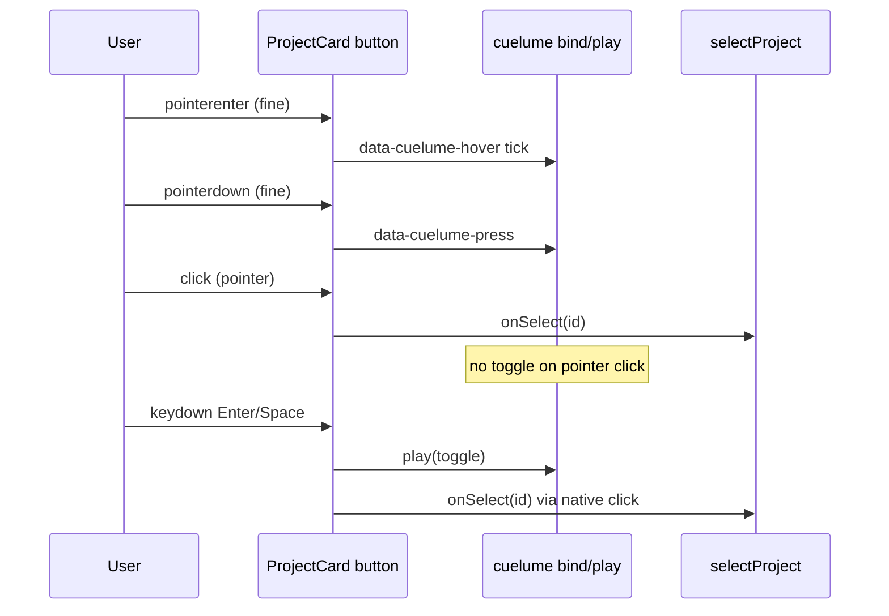

# Project Card Cuelume Sounds - Plan

## Goal Capsule

- **Objective:** Add Cuelume interaction sounds on portfolio project cards — hover tick, mouse press, and keyboard toggle without double-firing — as always-on craft polish for visitors.
- **Product authority:** This plan owns project-card sound feedback only. Layout, spotlight, reveal, and Bend remain under the home-page plan.
- **Open blockers:** None.
- **Product Contract preservation:** Product Contract unchanged.

---

## Product Contract

### Summary

Install Cuelume and wire project cards so fine-pointer hover plays **tick**, fine-pointer press plays **press**, and keyboard activation plays **toggle** without also firing toggle on mouse clicks.
Sounds are always on when the browser allows audio; reduced-motion preference does not silence them.
Mute UI and sounds on other controls are out of scope.

### Problem Frame

The portfolio home already has visual motion and spotlight pairing.
Without sonic feedback, project-card hover and select feel quieter than the craft bar design peers expect on a design-led site.
A thin, library-backed cue layer raises presence without adding preference chrome.

### Key Decisions

- KD1. **Cuelume for interaction cues** — adopt the package rather than custom Web Audio or media files. `(session-settled: user-directed — chosen over building sounds from scratch: install and use Cuelume press/tick.)` Governs R1.
- KD2. **Hover tick + mouse press on project cards** — no press+release pair in v1. `(session-settled: user-directed — chosen over press-only or press+release: add tick on hover and press on pointer-down.)` Governs R2, R3.
- KD3. **Keyboard toggle without mouse double-fire** — mouse keeps press only; keyboard activation plays toggle via a path that does not also run on pointer clicks. `(session-settled: user-directed — chosen over accepting press+toggle on mouse or toggle-only for all activation: cover keyboard without doubling mouse.)` Governs R4, R5.
- KD4. **Always-on, no mute control** — no visitor preference UI in v1. `(session-settled: user-directed — chosen over default-on mute control or opt-in: ship craft without preference chrome.)` Governs R6.
- KD5. **Reduced motion does not gate sound** — `prefers-reduced-motion` continues to govern motion only. `(session-settled: user-directed — chosen over silencing under reduced motion: motion preference is not a sound preference.)` Governs R7.
- KD6. **Attributes for hover/press; keyboard cue by hand** — use Cuelume data attributes + `bind()` for hover/press; play toggle only for keyboard activation. `(session-settled: user-approved — chosen over a fully imperative cue map: keep Cuelume’s normal path with a thin keyboard exception.)` Governs R1–R5.

<!-- ce-section: work-relationships -->
### How This Work Fits Together

This plan owns **project-card interaction sounds**.
It extends the shipped home-page experience; it does not reopen layout or spotlight product rules.

- Project card Cuelume sounds (this plan)
  - **Depends on:** Portfolio home page experience (`docs/plans/2026-08-09-001-feat-portfolio-home-plan.md`) — project cards and spotlight selection already exist
  - **Can proceed independently of:** Hosting, domain, case studies, mute UI

### Actors

- A1. Design peer / hiring visitor on fine pointer — hears hover tick and press when interacting with project cards.
- A2. Keyboard visitor — hears toggle when activating a project card with Enter/Space; does not rely on hover/press cues.
- A3. Touch visitor — may get no activation sound in v1 (fine-pointer hover/press; toggle reserved for keyboard). Accepted for this pass.

### Requirements

**Library and wiring**

- R1. The site depends on Cuelume and initializes its attribute binding so project-card cues work for the session after audio is allowed by the browser.
- R2. Each revealed, interactive project card plays Cuelume **tick** on fine-pointer hover.
- R3. Each revealed, interactive project card plays Cuelume **press** on fine-pointer pointer-down.
- R4. Keyboard activation of a project card (Enter/Space on the focused card) plays Cuelume **toggle**.
- R5. A mouse click on a project card must not play **toggle** in addition to **press** (no double cue on pointer click).

**Preference and scope**

- R6. There is no mute, volume, or sound-preference control in v1; sounds play whenever the browser permits playback.
- R7. Enabling `prefers-reduced-motion: reduce` must not, by itself, disable these interaction sounds.
- R8. Interaction sounds in this unit apply only to project cards — not identity header, media blocks, or other controls.

### Key Flows

- F1. Fine-pointer hover
  - **Trigger:** Pointer enters a revealed project card.
  - **Actors:** A1
  - **Steps:** Card receives fine-pointer enter; tick plays (subject to Cuelume’s hover throttling).
  - **Outcome:** Visitor hears tick without changing the active project.
  - **Covered by:** R2, R8

- F2. Fine-pointer select
  - **Trigger:** Pointer-down on a revealed project card, then click completes selection.
  - **Actors:** A1
  - **Steps:** Press plays on pointer-down; spotlight selection proceeds as today; toggle does not play for this pointer click.
  - **Outcome:** One press cue accompanies select; no second toggle cue.
  - **Covered by:** R3, R5

- F3. Keyboard select
  - **Trigger:** Focused revealed project card activated with Enter or Space.
  - **Actors:** A2
  - **Steps:** Toggle plays; spotlight selection proceeds as today.
  - **Outcome:** Keyboard select is audible without relying on hover/press.
  - **Covered by:** R4

### Acceptance Examples

- AE1. Hover tick
  - **Covers:** R2
  - **Given:** A revealed project card and a fine pointer
  - **When:** The pointer enters the card
  - **Then:** Tick plays once for that enter (further rapid hovers may be throttled by Cuelume)

- AE2. Mouse press without toggle
  - **Covers:** R3, R5
  - **Given:** A revealed project card and a fine pointer
  - **When:** The visitor presses and clicks the card to select it
  - **Then:** Press plays; toggle does not play for that click; the project becomes active per existing spotlight behavior

- AE3. Keyboard toggle
  - **Covers:** R4
  - **Given:** A revealed project card focused via keyboard
  - **When:** The visitor activates it with Enter or Space
  - **Then:** Toggle plays and the project becomes active

- AE4. Reduced motion still sounds
  - **Covers:** R7
  - **Given:** `prefers-reduced-motion: reduce` is enabled and a fine pointer
  - **When:** The visitor hovers then presses a project card
  - **Then:** Tick and press still play (motion may be reduced elsewhere)

### Scope Boundaries

**In scope**

- Cuelume dependency and binding for project-card hover tick, mouse press, and keyboard toggle without mouse double-fire
- Always-on playback subject to browser audio policy

**Deferred for later**

- Mute / volume preference UI
- Press+release pairing
- Sounds on non-project controls
- Touch-specific activation cues

**Outside this unit**

- Changes to spotlight, card reveal, Bend, layout, or project content

### Deferred to Follow-Up Work

- Mute / volume preference UI (product deferred)
- Press+release pairing and non-project control sounds (product deferred)

### Dependencies / Assumptions

- Portfolio home project cards already exist as interactive controls that select the active project (verified: `ProjectCard` → `onSelect` → `useActiveProject.selectProject`).
- Cuelume hover requires a fine pointer; press may also fire for touch/pen per current library docs — product still reserves **toggle** for keyboard only (A3 / R4).
- Browser autoplay / audio-context policies may delay the first cue until a user gesture; that is acceptable and not treated as a product defect.
- No existing sound layer or Cuelume dependency is present today (verified: `package.json` has no `cuelume`).

### Outstanding Questions

**Resolve Before Planning**

- None.

**Deferred to Implementation**

- Exact helper/hook name for `bind()` if extracted from `App` (optional; inline `useEffect` is fine).
- Whether Vitest mocks live in the suite file or `src/test/setup.ts` (prefer suite-local unless bind runs before every test and needs a global stub).

### Sources / Research

- Cuelume docs: attribute table, `bind()` / `play()`, React `useEffect(() => { bind() }, [])`, idempotent bind, SSR-safe import — https://www.npmjs.com/package/cuelume
- Existing UI touchpoints: `src/components/portfolio/ProjectCard.tsx`; reduced-motion hook at `src/hooks/usePrefersReducedMotion.ts` (must not gate these sounds per R7)
- Parent experience plan: `docs/plans/2026-08-09-001-feat-portfolio-home-plan.md`
- Spotlight coupling learning: `docs/solutions/ui-bugs/portfolio-spotlight-reveal-and-scroll-state.md` — do not alter selection / reveal / scroll-lock paths when adding sounds

---

## Planning Contract

### Summary

Add the `cuelume` dependency, call `bind()` once from the app shell, mark project cards with hover/press attributes, and play `toggle` only on keyboard activation so mouse clicks do not double-cue.
Keep spotlight, reveal, and Bend untouched; prove behavior with mocked `play` plus attribute assertions under Vitest.

### Key Technical Decisions

- KTD1. **`bind()` once from `App` via `useEffect`** — Cuelume’s documented React pattern; delegated listeners cover cards as they mount; `bind()` is idempotent under StrictMode remounts. Instantiates KD6 / R1.
- KTD2. **Keyboard `toggle` via `onKeyDown` (Enter/Space), not `onClick`** — native button activation fires `click` for both pointer and keyboard; putting `play('toggle')` on every `onClick` would double-fire with attribute press on mouse. Instantiates KD3 / R4, R5. How-level choice for the settled product rule in KD3 (mouse press only; keyboard toggle without double-fire).
- KTD3. **No `data-cuelume-toggle` on cards** — avoids Cuelume’s click-delegated toggle on pointer clicks; keyboard uses imperative `play('toggle')` only. Instantiates R5.
- KTD4. **Test with `vi.mock('cuelume')` — assert attributes and `play` calls, not Web Audio** — jsdom cannot reliably exercise synthesized audio; attribute + call-site contracts cover AE1–AE4-shaped behavior. Instantiates verification for R2–R5, R7.

### High-Level Technical Design

### Assumptions

- Cuelume latest 0.x (`npm install cuelume`) remains ESM-compatible with Vite.
- Unrevealed cards (`pointer-events-none`, `tabIndex={-1}`) will not receive hover/keyboard activation in normal use; attributes may still be present in the DOM.
- Existing `portfolio-spotlight` tests remain green without changes to `useActiveProject` / `useCardReveal`.

### Risks

| Risk | Mitigation |
|---|---|
| `play('toggle')` wrongly attached to `onClick` doubles mouse cues | KTD2 — keydown-only; tests assert click does not call `play` with toggle |
| Sound wiring accidentally changes spotlight | Keep handlers additive; do not edit `useActiveProject` / reveal hooks; keep spotlight suite green |
| StrictMode double-mount | Rely on Cuelume idempotent `bind()`; no custom once-guard required unless runtime proves otherwise |

---

## Implementation Units

### U1. Install Cuelume and bind at app shell

- **Goal:** Add the dependency and initialize attribute binding once for the document so later card markup can emit cues.
- **Requirements:** R1, R6
- **Dependencies:** None
- **Files:**
  - modify: `package.json` (and lockfile via install)
  - modify: `src/App.tsx`
- **Approach:**
  1. Install `cuelume` as a runtime dependency.
  2. In `App`, `useEffect(() => { bind() }, [])` after import from `cuelume`.
  3. Do not call `setEnabled(false)` or add mute UI (R6).
  4. Do not gate bind on `usePrefersReducedMotion` (R7 owned by later units’ non-gating).
- **Patterns to follow:** Cuelume React docs (`useEffect` + `bind()`); KTD1.
- **Test scenarios:** Covered in U3 (`bind` invocation assert).
- **Verification:** Dependency present; app builds; `bind` is called from the shell.

### U2. Project card hover/press attributes and keyboard toggle

- **Goal:** Wire project cards for tick on hover, press on pointer-down, and toggle on keyboard activation without mouse double-fire — without changing spotlight selection behavior.
- **Requirements:** R2, R3, R4, R5, R7, R8; F1–F3; AE1–AE4
- **Dependencies:** U1
- **Files:**
  - modify: `src/components/portfolio/ProjectCard.tsx`
- **Approach:**
  1. On the card `<button>`, set `data-cuelume-hover="tick"` and `data-cuelume-press` (default press sound).
  2. Do **not** add `data-cuelume-toggle`.
  3. On `keydown` for Enter or Space, when `revealed` and `!event.repeat`, call only `play('toggle')`. Do not call `onSelect` from keydown — leave selection to the existing `onClick` → `onSelect` path via the button’s native synthesized click.
  4. Do not import or consult `usePrefersReducedMotion` here (R7).
  5. Do not attach cues to identity header, media blocks, or other controls (R8).
- **Patterns to follow:** Existing `ProjectCard` button + `data-testid` / reveal guards; KTD2, KTD3; spotlight learning — sounds additive only.
- **Test scenarios:** Covered in U3.
- **Verification:** Manual desktop smoke: hover tick, press on click, Enter/Space toggle, no double cue on mouse; reduced-motion still sounds.

### U3. Automated cue contracts

- **Goal:** Prove attribute wiring and keyboard-vs-mouse `play` behavior under Vitest without requiring Web Audio.
- **Requirements:** R2–R5, R7; AE1–AE4 (automated shape)
- **Dependencies:** U1, U2
- **Files:**
  - create: `src/test/portfolio-cuelume.test.tsx`
  - optionally modify: `src/test/setup.ts` only if a global `cuelume` stub is needed
- **Approach:**
  1. `vi.mock('cuelume')` exporting `bind` and `play` as `vi.fn()`.
  2. Render `PortfolioPage` (or `ProjectCard` with props) using existing test setup patterns from `portfolio-spotlight.test.tsx`.
  3. Assert cards expose `data-cuelume-hover="tick"` and `data-cuelume-press`, and lack `data-cuelume-toggle`.
  4. `userEvent.click` a revealed card → `play` must not be called with `'toggle'`.
  5. Focus a revealed card and `userEvent.keyboard('{Enter}')` (and/or Space) → `play` called with `'toggle'`; selection still updates active state.
  6. With `matchMedia` forced to reduced-motion (existing motion-test pattern), attributes remain present / keyboard `play('toggle')` still runs — do not assert silence.
- **Execution note:** Prefer call-site and attribute contracts over attempting real AudioContext playback.
- **Patterns to follow:** KTD4; `src/test/portfolio-spotlight.test.tsx` userEvent + mocks; `src/test/portfolio-motion.test.tsx` matchMedia override.
- **Test scenarios:**
  - Happy path: after render, mocked `bind` was invoked (U1 / R1).
  - Covers AE1 (shape). Revealed project card has `data-cuelume-hover="tick"`.
  - Covers AE2 (shape). Pointer click does not call mocked `play('toggle')`; card still becomes active.
  - Covers AE3. Enter (and Space) on a focused revealed card calls `play('toggle')` once and activates the project via native click (no second `onSelect` from the keydown handler).
  - Covers AE4 (shape). With prefers-reduced-motion, hover/press attributes remain and keyboard `play('toggle')` is not gated off.
  - Edge: unrevealed card does not call `play('toggle')` on keydown when interaction is blocked.
  - Edge: held Enter with `event.repeat` does not call `play('toggle')` repeatedly.
  - Integration: existing spotlight click → active media behavior still passes (`npm test` full suite).
- **Verification:** New suite green; full `npm test` green; no spotlight regressions.

---

## Verification Contract

| Gate | Command / action | Applies |
|---|---|---|
| Unit/integration | `npm test` | After U1–U3 |
| Production build | `npm run build` | After U1–U2 |
| Dev smoke | `npm run dev` — hover tick, press on card click, Enter/Space toggle, no double cue on mouse | After U2 |
| Reduced-motion smoke | Enable reduced motion; confirm cues still play | After U2 |
| Spotlight regression | Existing `portfolio-spotlight` tests remain green | After U2–U3 |

---

## Definition of Done

- Implementation units U1–U3 complete with their verification outcomes met.
- Product requirements R1–R8 satisfied for project-card sounds.
- AE1–AE4 covered by automated attribute/`play` contracts and/or documented smoke.
- `npm test` and `npm run build` succeed.
- No mute UI, no press+release, no non-project control sounds, no spotlight/reveal/Bend product changes.
