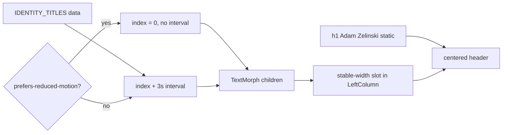

# Rotating Identity Subtitle - Plan

## Goal Capsule

- **Objective:** Replace the static left-column “Head of Design” line with a looping character-morph cycle of identity titles using torph `TextMorph`.
- **Product authority:** This plan owns only the identity subtitle under the name. Project cards, Spotlight, sounds, and layout chrome stay under their existing plans.
- **Open blockers:** None.
- **Product Contract preservation:** Product Contract unchanged.

---

## Product Contract

### Summary

Install torph and morph the left-column subtitle through a fixed ordered list of identity titles on a ~3s dwell, with stable width so the header does not jitter.
Character morph via `TextMorph` is the motion; vertical slide and whole-phrase fade are out.

### Problem Frame

The portfolio identity header currently shows a single static role line.
A light, looping personality cycle makes the left column feel more personal without adding controls or competing with project browsing.

### Key Decisions

- KD1. **torph `TextMorph` from `torph/react`** — install and use that API for the subtitle. `(session-settled: user-directed — chosen over CSS-only vertical slide: keep npm i torph + TextMorph after the slide vs morph conflict.)` Governs R1, R2.
- KD2. **Character morph, not vertical slide** — letters rematerialize between phrases. `(session-settled: user-directed — chosen over vertical slide (probe C) and whole-phrase fade: torph is the motion tool.)` Governs R2.
- KD3. **~3s readable dwell** before each morph. `(session-settled: user-directed — chosen over ~1.5–2s quick loop or ~5s ambient: enough time to read each title.)` Governs R4.
- KD4. **Stable width sized to the longest phrase** — avoid sideways jitter under the name. `(session-settled: user-directed — chosen over natural width reflow: keep the header calm.)` Governs R5.
- KD5. **Correct “Sandwhich” → “Sandwich Enthusiast”** — treat the original spelling as a typo. `(session-settled: user-approved — chosen over keeping the misspelling: confirmed in scoping synthesis.)` Governs R3.

<!-- ce-section: work-relationships -->
### How This Work Fits Together

This plan owns the **rotating identity subtitle** only.
It extends the shipped home-page left column; it does not reopen Spotlight, card reveal, or Cuelume sounds.

- Rotating identity subtitle (this plan)
  - **Depends on:** Portfolio home page experience (`docs/plans/2026-08-09-001-feat-portfolio-home-plan.md`) — left-column name + subtitle already exist
  - **Can proceed independently of:** Project card Cuelume sounds (`docs/plans/2026-08-09-002-feat-project-card-cuelume-sounds-plan.md`), hosting, case studies

### Actors

- A1. Portfolio visitor — sees the subtitle cycle under the name while browsing projects; no interaction required.

### Requirements

**Library and content**

- R1. The site depends on torph and renders the left-column identity subtitle with `TextMorph` from `torph/react`.
- R2. When the active title string changes, the subtitle uses character morph (not a vertical slide or whole-phrase-only fade as the primary motion).
- R3. The cycle uses this exact order, then loops to the start: Head of Design → Coffee Drinker → Baseball Watcher → App Developer → Record Collector → Carlton Supporter → Sandwich Enthusiast.

**Pacing and layout**

- R4. Each title remains readable for about 3 seconds before morphing to the next.
- R5. The subtitle occupies a stable horizontal width sized for the longest phrase so name/subtitle alignment does not jitter as titles change.
- R6. The name “Adam Zelinski” stays static; only the muted subtitle line cycles.

**Motion preference**

- R7. When `prefers-reduced-motion: reduce` is set, the subtitle must not run the looping morph animation; show a non-distracting presentation of the titles (static first title or equivalent) consistent with torph’s reduced-motion support and the site’s existing motion preference patterns.

### Key Flows

- F1. Idle identity cycle
  - **Trigger:** Visitor loads the portfolio home with motion allowed.
  - **Actors:** A1
  - **Steps:** Subtitle shows “Head of Design”; after ~3s it morphs through the remaining titles in order; after the last title it returns to “Head of Design” and continues.
  - **Outcome:** Continuous, readable personality cycle under the name.
  - **Covered by:** R1–R6

- F2. Reduced motion
  - **Trigger:** Visitor has `prefers-reduced-motion: reduce`.
  - **Actors:** A1
  - **Steps:** Page loads; subtitle does not loop-morph through titles.
  - **Outcome:** Identity line remains calm; no continuous morph distraction.
  - **Covered by:** R7

### Acceptance Examples

- AE1. Happy path cycle
  - **Covers:** R3, R4
  - **Given:** Motion is allowed and the home page is visible
  - **When:** Roughly 3 seconds pass on “Head of Design”
  - **Then:** The subtitle morphs to “Coffee Drinker”, then continues through the full ordered list and loops

- AE2. Stable width
  - **Covers:** R5
  - **Given:** The cycle reaches a short title (e.g. “Coffee Drinker”) and a long title (e.g. “Sandwich Enthusiast”)
  - **When:** The morph completes between them
  - **Then:** The subtitle’s reserved width does not visibly shrink/grow enough to jitter the centered header

- AE3. Reduced motion calm
  - **Covers:** R7
  - **Given:** `prefers-reduced-motion: reduce`
  - **When:** The home page loads and time passes
  - **Then:** The subtitle does not continuously morph through the title list

### Scope Boundaries

**In scope**

- torph install and `TextMorph` on the left-column identity subtitle
- Fixed ordered loop with ~3s dwell and stable width

**Deferred for later**

- Manual advance, pause on hover, or random order
- Animating the name or project-card copy

**Outside this unit**

- Vertical slide / ticker motion as the primary transition
- New preference UI for the cycle

### Dependencies / Assumptions

- Confirmed: subtitle is currently static in `src/components/portfolio/LeftColumn.tsx`; torph is not yet a dependency; reduced-motion hook/CSS already exist.
- Reduced-motion presentation for R7 is owned by Planning Contract KTD2 (freeze on first title; do not rely on torph’s instant-swap-while-cycling alone).

---

## Planning Contract

### Key Technical Decisions

- KTD1. **Interval-driven `TextMorph` children** — `useState` index + `setInterval(3000)` advances the active title string into `TextMorph` children (official cycling pattern). Morph `duration` stays at torph default (~400ms) so dwell ≫ morph. Governs R1, R2, R4. `(session-settled product KD1/KD3 instantiate this how.)`
- KTD2. **Freeze cycle under reduced motion** — when `usePrefersReducedMotion()` is true, keep index at 0 (“Head of Design”), do not start the interval, and pass `disabled` (or equivalent) so titles do not keep swapping instantly every 3s. Torph’s default `respectReducedMotion` alone is not enough for R7/AE3. Governs R7.
- KTD3. **Stable width via reserved slot** — wrap `TextMorph` in a centered container whose width is reserved to the longest title (invisible longest-phrase measure or equivalent `min-width` technique). Do not rely on torph’s internal width animation alone; it animates container size and can reflow the header. Governs R5.
- KTD4. **Mock `torph/react` in Vitest** — stub `TextMorph` as a passthrough that renders children as text so layout/motion suites stay deterministic without Web Animations. Mirrors the `vi.mock('cuelume')` pattern.

### High-Level Technical Design

### Assumptions

- Latest torph 0.x (`npm install torph`) remains ESM-compatible with Vite + React 19 (`torph/react` peer `react >=18`).
- Freezing on the first title under reduced motion satisfies R7’s “static first title or equivalent.”
- LeftColumn edits stay additive: Spotlight reveal/active OR, Cuelume cues, and scroll-lock behavior are untouched.
- Existing `portfolio-spotlight` and `portfolio-cuelume` suites remain green without changes to `useActiveProject` / `useCardReveal`.

### Risks

| Risk | Mitigation |
|---|---|
| Torph width/height animation jitters the centered header | KTD3 reserved slot sized to longest phrase |
| Interval keeps cycling under reduced motion with instant swaps | KTD2 freeze interval + static first title |
| LeftColumn edit regresses Spotlight / Cuelume | Additive-only header change; keep spotlight + cuelume suites green |
| Empty-string morph edge case | Never cycle through `""`; titles array is non-empty constants |

### Sources & Research

- torph React / quickstart: https://mintlify.wiki/lochie/torph/frameworks/react , https://mintlify.wiki/lochie/torph/quickstart
- torph animation / sizing: https://mintlify.wiki/lochie/torph/advanced/animation-details
- Local patterns: `src/components/portfolio/LeftColumn.tsx`, `src/hooks/usePrefersReducedMotion.ts`, `src/data/projects.ts`, `src/test/portfolio-layout.test.tsx`, `src/test/matchMedia.ts`
- Learnings: `docs/solutions/ui-bugs/portfolio-spotlight-reveal-and-scroll-state.md`, `docs/solutions/best-practices/portfolio-cuelume-card-sounds-without-double-firing.md`

---

## Implementation Units

### U1. Install torph and identity title data

- **Goal:** Add the runtime dependency and a typed ordered title list matching R3.
- **Requirements:** R1, R3
- **Dependencies:** None
- **Files:**
  - modify: `package.json` (and lockfile via install)
  - create: `src/data/identityTitles.ts`
- **Approach:**
  1. `npm install torph` as a runtime dependency.
  2. Export `IDENTITY_TITLES` as a `as const` string array in R3 order, starting with “Head of Design” and ending with “Sandwich Enthusiast.”
  3. Optionally export a derived `LONGEST_IDENTITY_TITLE` helper for the stable-width slot (or compute max length at the call site).
- **Patterns to follow:** `src/data/projects.ts` typed export style; KTD1 content source.
- **Test scenarios:** Covered in U3 (titles order / first title assertions).
- **Verification:** Dependency present; module exports the seven titles in order.

### U2. Wire LeftColumn Identity subtitle with TextMorph

- **Goal:** Replace the static subtitle `
` with a cycling `TextMorph` under a stable-width slot, freezing under reduced motion, without changing the name or project-list behavior.
- **Requirements:** R1–R7; F1, F2; AE1–AE3
- **Dependencies:** U1
- **Files:**
  - modify: `src/components/portfolio/LeftColumn.tsx`
  - optionally create: `src/components/portfolio/IdentitySubtitle.tsx` if extracting keeps `LeftColumn` readable
- **Approach:**
  1. Keep `h1` “Adam Zelinski” unchanged (R6).
  2. Import `TextMorph` from `torph/react` and `IDENTITY_TITLES` from data.
  3. Use `usePrefersReducedMotion()`: if true, render `TextMorph` (or plain text) stuck on `IDENTITY_TITLES[0]` with no interval (KTD2).
  4. If motion allowed: `useState(0)` + `useEffect` interval 3000ms advancing `(i + 1) % length`, cleanup on unmount; feed `IDENTITY_TITLES[i]` as `TextMorph` children (KTD1). Leave morph `duration` at default (~400ms); pin `as` explicitly (e.g. `"span"`).
  5. Wrap the morph in a centered stable-width slot reserved for the longest title (KTD3) so short phrases do not shrink the header.
  6. Preserve existing muted typography classes on the subtitle line.
  7. Do not edit project-card, Spotlight, reveal, or Cuelume wiring.
- **Patterns to follow:** Existing header markup in `LeftColumn`; `usePrefersReducedMotion` usage in `PortfolioPage` / `useCardReveal`; torph React cycling example; KTD1–KTD3.
- **Execution note:** Prefer a small focused component if `LeftColumn` would otherwise mix interval state with list rendering — either shape is fine if R6/R7 hold.
- **Test scenarios:** Covered in U3.
- **Verification:** Dev smoke — titles cycle ~3s with character morph; reduced motion shows only “Head of Design”; header does not jitter; project list still works.

### U3. Automated identity-subtitle contracts

- **Goal:** Prove first title, ordered cycle advancement under fake timers, reduced-motion freeze, and no Spotlight/Cuelume regressions.
- **Requirements:** R3, R4, R7; AE1, AE3 (automated shape); AE2 smoke-only
- **Dependencies:** U1, U2
- **Files:**
  - create: `src/test/portfolio-identity-subtitle.test.tsx`
  - modify: `src/test/portfolio-layout.test.tsx` (still expects “Head of Design” / first title)
- **Approach:**
  1. `vi.mock('torph/react')` with `TextMorph` rendering children in a testable element (KTD4).
  2. Assert initial render shows “Head of Design” (and name still static).
  3. With `vi.useFakeTimers()`, advance ~3000ms → expect “Coffee Drinker”; advance through remaining titles and assert wrap to “Head of Design.”
  4. With `mockPrefersReducedMotion()`, render and advance timers → still “Head of Design” only (no cycle).
  5. Keep layout suite asserting identity + projects; do not assert pixel-perfect width in unit tests (AE2 remains manual/dev smoke).
  6. Run full `npm test` including spotlight + cuelume suites.
- **Execution note:** Prefer fake-timer index advancement over asserting Web Animations morph internals.
- **Patterns to follow:** `src/test/portfolio-cuelume.test.tsx` mocks; `src/test/matchMedia.ts`; `src/test/portfolio-layout.test.tsx`.
- **Test scenarios:**
  - Happy path: initial subtitle is “Head of Design”; name is “Adam Zelinski.”
  - Covers AE1 (shape). After 3000ms fake time, subtitle is “Coffee Drinker.”
  - Happy path: after seven intervals, subtitle returns to “Head of Design.”
  - Covers AE3. With prefers-reduced-motion, after several intervals subtitle remains “Head of Design.”
  - Integration: `portfolio-layout`, `portfolio-spotlight`, and `portfolio-cuelume` suites stay green.
- **Verification:** New suite green; full `npm test` green; AE2 confirmed in `npm run dev` smoke.

---

## Verification Contract

| Gate | Command / action | Applies |
|---|---|---|
| Unit/integration | `npm test` | After U1–U3 |
| Production build | `npm run build` | After U1–U2 |
| Dev smoke | `npm run dev` — titles morph on ~3s dwell; stable width; name static | After U2 |
| Reduced-motion smoke | Enable reduced motion; confirm freeze on “Head of Design” | After U2 |
| Regression | Existing spotlight + cuelume suites remain green | After U2–U3 |

---

## Definition of Done

- Implementation units U1–U3 complete with their verification outcomes met.
- Product requirements R1–R7 satisfied for the Identity subtitle.
- AE1 and AE3 covered by automated contracts; AE2 covered by documented smoke.
- `npm test` and `npm run build` succeed.
- No vertical-slide primary motion, no name animation, no project-list/Spotlight/Cuelume product changes.
